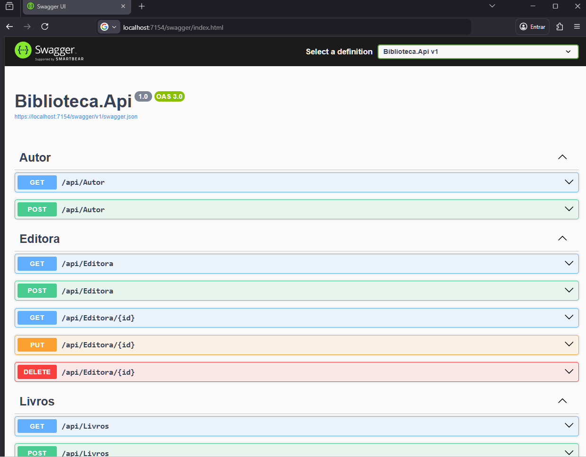

# 📚 Biblioteca.Api


API REST desenvolvida em ASP.NET Core, um CRUD para gerenciamento de livros em uma biblioteca com Entity Framework Core

---

## Funcionalidades

- Cadastro de livros
- Consulta de livro por ID
- Listagem de todos os livros 
- Atualização de dados de um livro
- Cadastro de editora
- Consulta de editora por ID
- Listagem de todas as editoras
- Atualização de dados de uma editora
- Remoção de editora
- Cadastro de autores
- Consulta de autores (lista)

## Organização do Projeto

Classes organizadas em diretórios: 

- Model: Entidades do domínio
- Service: Regras de negócio
- Controllers: Endpoints da API
- DTOs : Objetos de transferência de dados
- Mappers: Conversão entre entidades e DTOs
- Validations: Validações de dados

Biblioteca.Api
│
├── Controllers
│   ├── AutorController.cs
│   ├── EditoraController.cs
│   └── LivrosController.cs
│
├── DTOs
│   ├── AutorDTO.cs
│   ├── EditoraDTO.cs
│   └── LivroDTO.cs
│
├── Service
│   ├── AutorService.cs
│   ├── EditoraService.cs
│   └── LivrosService.cs
│
├── Validators
│   ├── AutorDtoValidator.cs
│   ├── EditoraDtoValidator.cs
│   └── LivroDtoValidator.cs
│
├── Mappers
│   ├── AutorMapper.cs
│   ├── EditoraMapper.cs
│   └── LivroMapper.cs
│
├── Models
│   ├── Entities
│   │   ├── Autor.cs
│   │   ├── Editora.cs
│   │   └── Livro.cs
│   │
│   ├── Mappings
│   │   ├── AutorMapping.cs
│   │   ├── EditoraMapping.cs
│   │   └── LivroMapping.cs
│   │
│   └── Context
│       └── BibliotecaContext.cs
│
├── Common
│   └── ErrorResponse.cs
│
├── appsettings.json
└── Program.cs

## Endpoints

## Autores:

| Método | Rota               | Descrição                     |
|--------|--------------------|-------------------------------|
| GET    | /api/autor         | Lista todos os autores        |
| POST   | /api/autor         | Cadastra um novo autor        |

## Editora

| Método | Rota               | Descrição                     |
|--------|--------------------|-------------------------------|
| GET    | /api/editora       | Lista todas as editoras       |
| GET    | /api/editora/{id}  | Lista uma editora por ID      |
| POST   | /api/editora       | Cadastra uma editora          |  
| PUT    | /api/editora/{id}  | Atualiza dados de uma editora |
| DELETE | /api/editora/{id}  | Remove uma editora            |

## Livros

| Método | Rota               | Descrição                     |
|--------|--------------------|-------------------------------|
| GET    | /api/livros        | Lista todos os livros         |
| GET    | /api/livros/{id}   | Lista um livro por ID         |
| POST   | /api/livros        | Cadastra um novo livro        |
| PUT    | /api/livros/{id}   | Atualiza os dados de um livro |
| DELETE | /api/livros/{id}   | Remove um livro               |


<br>

<br>

## Tecnologias utilizadas

- ASP.NET Core 8
- Entity Framework Core
- Fluent API (mapeamento do banco de dados)
- Pomelo.EntityFrameworkCore.MySql
- MySQL 8.0.40
- Swagger / OpenAPI

### Pré-requisitos
- .NET SDK 8
- MySQL 8+

## Como executar o projeto

1. Clone o repositório de Projetos:
   ```bash
   git clone https://github.com/PedroCr13/Estudos-Projetos-Charp.git

2. Acesse a pasta do projeto:    
   ```bash
   cd Estudos-Projetos-Charp/Biblioteca.Api

2. Execute no Visual Studio
